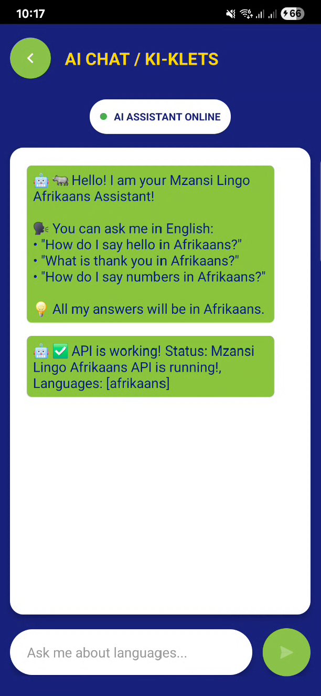
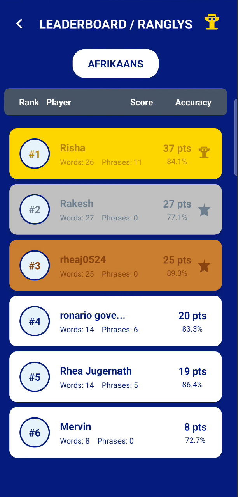

# 🌍 Mzansi Lingo

**Mzansi Lingo** is an Android-based language learning app designed to help **South Africans** improve their **Afrikaans vocabulary, phrases, and pronunciation** through interactive lessons, daily goals, AI chat support, and progress tracking.

---

## 📑 Table of Contents

- [Overview](#overview)  
- [Technologies Used](#technologies-used)  
- [System Functionalities & User Roles](#system-functionalities--user-roles)  
- [Setup Instructions](#setup-instructions)  
- [Architecture](#architecture)  
- [YouTube Demo](#youtube-demo)  
- [Code Attribution](#code-attribution)  
- [Contact](#contact)  

---

## Overview

The primary goal of **Mzansi Lingo** is to provide a focused, immersive platform for learning **Afrikaans**. Users can learn words, phrases, and quotes, track their progress, and practice pronunciation. Key features include:

- **Daily Goals**: Users complete word and phrase goals each day and receive gamification pop-ups as motivation.  
- **Audio-Based Learning**: Users can hear correct pronunciation for words, phrases, and quotes.  
- **AI Chat Support**: Users can ask a chatbot how to say or pronounce certain words or phrases.  
- **Progress Tracking**: Users earn points and can monitor their learning progress.  
- **Leaderboards**: Compare progress with others using the app.
- **Set goals**: Users can set daily goals for the words and phrases to get right.

This app is designed for individual learners and emphasizes **consistency, pronunciation accuracy, and interactive learning**.  

---

## Technologies Used

- **Kotlin** – Android app development  
- **Android Studio** – IDE for building the app  
- **REST API** – Hosted on Railway for AI chatbot integration  
- **Firebase** – Optional backend features for data storage and analytics  
- **XML** – Layouts and UI design  
- **Git & GitHub** – Version control
- **Visual Studio Code** - IDE for building API

---

## System Functionalities & User Roles

### Learners
- Track progress on words and phrases.  
- Complete daily goals for words and phrases.  
- Listen to pronunciation through audio playback.  
- Interact with AI chatbot for pronunciation guidance.  
- View points, goals and leaderboards.  

### App Features
- **Navigation Bar**: Home, Language, Words, Phrases, Leaderboard, Visibility Modes, Settings, Profile.  
- **Settings**: Manage profile, notifications, privacy & security, help & support, visibility modes, about, and logout.  
- **Gamification**: Pop-ups triggered after completing daily goals for words, phrases, or both.  
- **Speech-Based Learning**: Built-in speakers pronounce words, phrases, and quotes.  
- **AI Chat Support**: Users can ask for correct pronunciation and spelling guidance.
- **Set goals**: Users can set daily goals for the words and phrases to get right.

---

## Setup Instructions

### 1. Prerequisites
- [Android Studio](https://developer.android.com/studio)  
- Java Development Kit (JDK) 11+  
- Git  

---

### 2. Clone the Repository
```bash
git clone https://github.com/Rhea0524/MzansiLingo.git
```
### 3. Open in Android Studio
- Open Android Studio.
- Click **Open an existing project** and select the cloned repository.

### 4. Configure API Key for AI Chatbot
- Add your AI chatbot API key in `ApiKeyManager.kt` (or use a secure environment variable).

### 5. Run the Application
- Connect an Android device or emulator.
- Press **Run** (green play button) in Android Studio.

---

## Architecture

### App Structure
- The app is built in **Android Studio** using **Empty Activities** for each screen.  
- Each activity handles a single feature, keeping the code modular and easy to maintain:  
  - `HomeActivity` – Displays daily goals, progress, and navigation.  
  - `WordsActivity` & `PhrasesActivity` – Show lists of words and phrases to learn.  
  - `AiChatActivity` – Handles AI chatbot interactions.  
  - `LeaderboardActivity` – Displays points and user rankings.  
  - `SettingsActivity` & `ProfileActivity` – Manage user preferences and account details.  

### Data Flow
- User interactions in each activity are handled locally and asynchronously.  
- **REST API on Railway** powers the AI chatbot, allowing users to ask for pronunciation guidance or translations.  
- Progress tracking, points, and gamification pop-ups are calculated and displayed directly in the app.  

---

## Code Attribution
Resources used in development:  
- [Android Developer Documentation](https://developer.android.com/docs)  
- [Kotlin Language Reference](https://kotlinlang.org/docs/reference/)  
- [Material Design Guidelines](https://material.io/design)

---

## YouTube Demo

### Screenshots of the App
- **Home Screen:**   
- **AI Chat:**   
- **Leaderboard:**   

Watch the full demo [here](https://youtu.be/your-demo-link).

---

## Contact

For any questions, feedback, or collaboration opportunities, you can reach out to:

**Mzansi Lingo**  
Email: [mzansilingo@gmail.com](mailto:mzansilingo@gmail.com)  

