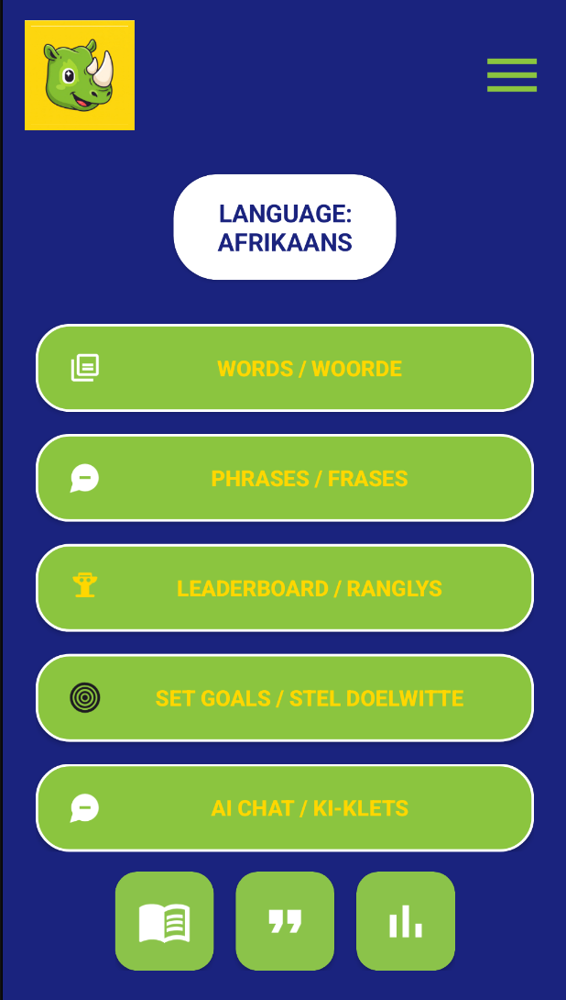

# 🌍 Mzansi Lingo

**Mzansi Lingo** is an Android-based language learning app designed to help **South Africans** improve their **Afrikaans vocabulary, phrases, and pronunciation** through interactive lessons, daily goals, AI chat support, and progress tracking.

---

## 📑 Table of Contents

- [Overview](#overview)  
- [Technologies Used](#technologies-used)
- [Latest Features 2025 Update](#latest-features-2025-update)   
- [System Functionalities & User Roles](#system-functionalities--user-roles)  
- [Setup Instructions](#setup-instructions)  
- [Architecture](#architecture)  
- [YouTube Demo](#youtube-demo)  
- [Code Attribution](#code-attribution)  
- [Contact](#contact)  

---

## Overview

The primary goal of **Mzansi Lingo** is to provide a focused, immersive platform for learning **Afrikaans**. Users can learn words, phrases, and quotes, track their progress, and practice pronunciation. Key features include:

- **Daily Goals**: Users complete word and phrase goals each day and receive gamification pop-ups as motivation.  
- **Audio-Based Learning**: Users can hear correct pronunciation for words, phrases, and quotes.  
- **AI Chat Support**: Users can ask a chatbot how to say or pronounce certain words or phrases.  
- **Progress Tracking**: Users earn points and can monitor their learning progress and can share screenshots of their progress with friends.  
- **Leaderboards**: Compare progress with others using the app.
- **Set goals**: Users can set daily goals for the words and phrases to get right.

This app is designed for individual learners and emphasizes **consistency, pronunciation accuracy, and interactive learning**.  

---

## Technologies Used

-	Kotlin – Main app development language
-	Android Studio – IDE
-	XML – UI layout design
-	REST API (Railway) – For AI chatbot integration
-	Retrofit – API communication
-	BiometricPrompt API – Biometric authentication
-	Firebase Cloud Messaging (FCM) – Real-time notifications
-	Room Database / Local Caching – Offline mode data
-	Coroutine Support (Kotlin) – Asynchronous tasks
-	Git & GitHub – Version control


---

## System Functionalities and User Roles

### Learners

Learners can:

- Study words, phrases, and quotes  
- Listen to audio pronunciation  
- Track progress and points  
- Complete daily goals and streaks  
- Use AI chatbot for translations  
- Capture progress screenshots  
- Enable biometric login  
- Operate offline  
- Select preferred language  
- View leaderboards  
 

### App Features
- Gamification (points, progress pop-ups)  
- Audio-based pronunciation  
- Real-time notifications  
- Offline access to saved learning content  
- Biometric login  
- Multilingual interface  
- AI chatbot for translations and pronunciation  
- Leaderboards and progress tracking  

---

## Setup Instructions

### 1. Prerequisites
- [Android Studio](https://developer.android.com/studio)  
- Java Development Kit (JDK) 11+  
- Git  

---

### 2. Clone the Repository
```bash
git clone https://github.com/Rhea0524/MzansiLingo.git
```
### 3. Open in Android Studio
- Open Android Studio.
- Click **Open an existing project** and select the cloned repository.

### 4. Configure API Key for AI Chatbot
- Add your AI chatbot API key in `ApiKeyManager.kt` (or use a secure environment variable).

### 5. Run the Application
- Connect an Android device or emulator.
- Press **Run** (green play button) in Android Studio.

---

## Architecture

### App Structure
| Component | Description |
|----------|-------------|
| HomeActivity | Displays daily goals, progress, and navigation |
| WordsActivity | Shows a list of Afrikaans words |
| PhrasesActivity | Displays Afrikaans phrases |
| AiChatActivity | Provides AI chatbot interactions |
| LeaderboardActivity | Shows user rankings |
| SettingsActivity | Language selection, notifications, user preferences |
| ProfileActivity | Displays progress and user details |
| BiometricAuthActivity | Manages biometric authentication |
| OfflineManager | Manages local content caching |
| NotificationService | Sends reminders and updates |

### Data Flow
- User actions update the Room database and UI in real time  
- AI chatbot communication uses Retrofit to access a REST API  
- Offline content is stored locally and syncs automatically when online  
- Notifications use Firebase Cloud Messaging  
- BiometricPrompt activates during user authentication  

---

## Code Attribution / References

The following resources were referenced or used during the development of **Mzansi Lingo**:

- [Android Developer Documentation](https://developer.android.com/docs) – Official guides and tutorials for Android app development.  
- [Kotlin Language Reference](https://kotlinlang.org/docs/reference/) – Official Kotlin language documentation.  
- [Material Design Guidelines](https://material.io/design) – UI/UX design principles for Android apps.  
- [REST API Integration in Android](https://developer.android.com/training/volley) – Documentation on connecting Android apps to REST APIs.  
- [Retrofit Library for Android](https://square.github.io/retrofit/) – Used for making HTTP requests to the AI chatbot API.  
- [Firebase Documentation](https://firebase.google.com/docs) – For optional backend features, analytics, and storage.  
- [OpenAI / AI Chatbot Integration Tutorials](https://platform.openai.com/docs) – Guidelines for integrating AI chatbot functionality via API.  
- [Git & GitHub Documentation](https://docs.github.com/) – Version control and repository management.  
- [Android Studio Layouts and Empty Activity Guide](https://developer.android.com/studio/projects/create-project) – Used for structuring app screens and activities.  
- [Android RecyclerView Guide](https://developer.android.com/guide/topics/ui/layout/recyclerview) – Used for displaying lists of words, phrases, and leaderboard items.  
- [Glide Image Loading Library](https://github.com/bumptech/glide) – If used for loading icons or images in the app.  
- [Stack Overflow](https://stackoverflow.com/) – Troubleshooting common Android/Kotlin issues.  
- [YouTube Tutorials for Android Development](https://www.youtube.com/) – For examples of Android UI, navigation, and activity management.  
- [Kotlin Coroutines Guide](https://kotlinlang.org/docs/coroutines-overview.html) – Used for asynchronous tasks like API calls.
- Android BiometricPrompt Documentation
-	Room Database Guide
-	Firebase Cloud Messaging Docs
-	Android Localization (strings.xml multi-language support)
 

----

## YouTube Demo
## 📱 Screenshots of the App

### Home Screen


### AI Chat


### Leaderboard


### Full Demo
Watch the full demo [here](https://youtu.be/your-demo-link).

----

## Contact

For any questions, feedback, or collaboration opportunities, you can reach out to:

**Mzansi Lingo**  
Email: [mzansilingo@gmail.com](mailto:mzansilingo@gmail.com)  

